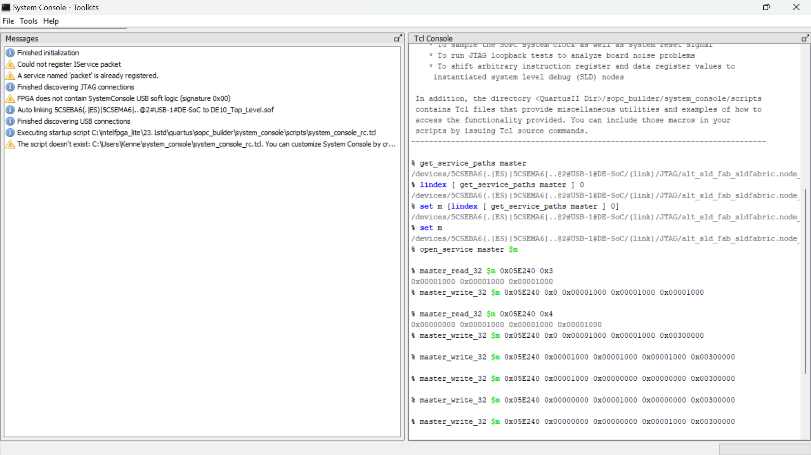

# homework 10: RGB led controller
## By: Kenneth Vincent

## Overview
This homework assignment I will create a RGB LED controller using the PWM controller from hw 8. I 
will also use the Avalon hps bus system to make and write to the registers.

## Deliverable
calculatons for the resistors:
for the red LED - $\ (2.3-3.2)/(0.01) = 10 ohms
for the green and blue LED - $\ (3.3-3.2)/(0.01) = 110 ohms

When it comes to the usage of the terminal to write to the registers to change the colors I used 
the following path of commands in the terminal:

The terminal used above has created the following LED colors

The red LED:

The green LED:

The blue LED:

With the requirment of a custom color, I have chosen to create a yellow LED color.
The yellow LED:
