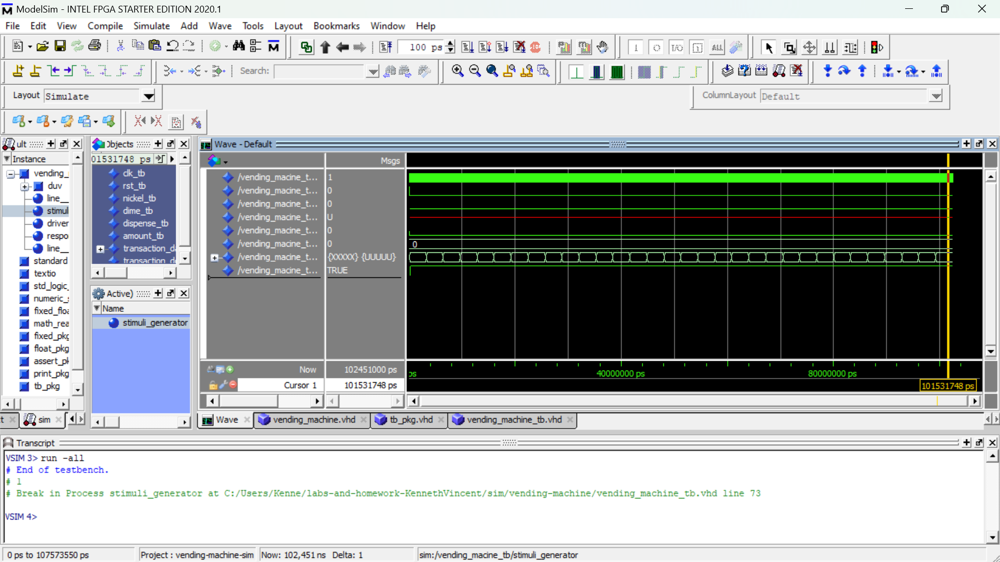

# Homework 5: vending machine exercise
## by: Kenneth Vincent

## overveiw
This homework is about making a finite state machine that only accepts dimes and nickels and adds up to 15 cents to give an item out before going back to 0 cents.
it would also display the amount in 16 bit natural value.

## Deliverables

