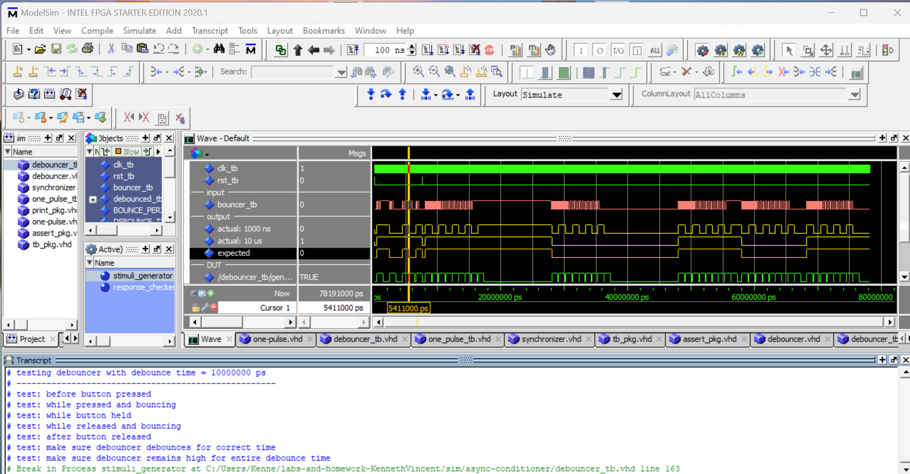

# homework 6: Async Conditioner
## By: Kenneth Vincent

## Overview
For this homework I am to create an async conditioner, this will be used for external signals
for FPGAs such as a button push. This conditioner will be made up of three components,
a debouncer, a syncronizer, and a one pulse.

## Deliverables

### debouncers

### one pulse (the one pusle is real)

### async conditioner

