# homework 7: linux cli practice
## By: Kenneth Vincent

## Overview
To practice linux commands in cli.

## Deliverables

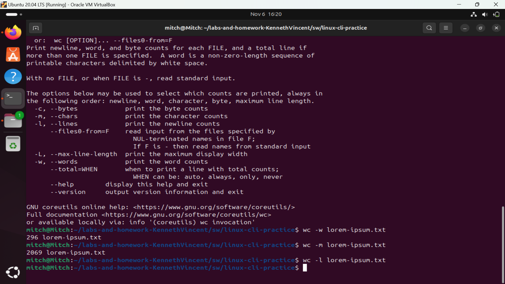

command: sort -n file-sizes.txt
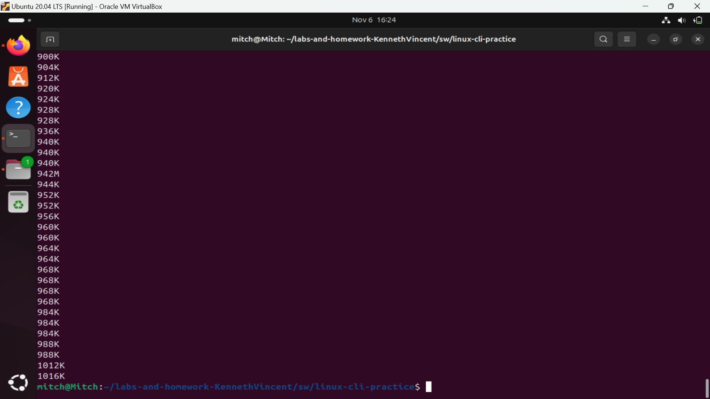

command: sort -n -r file-sizes.txt
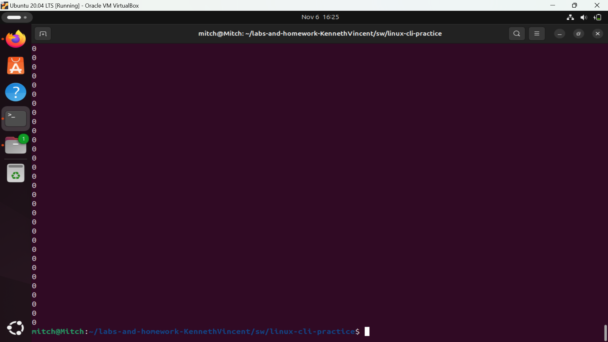

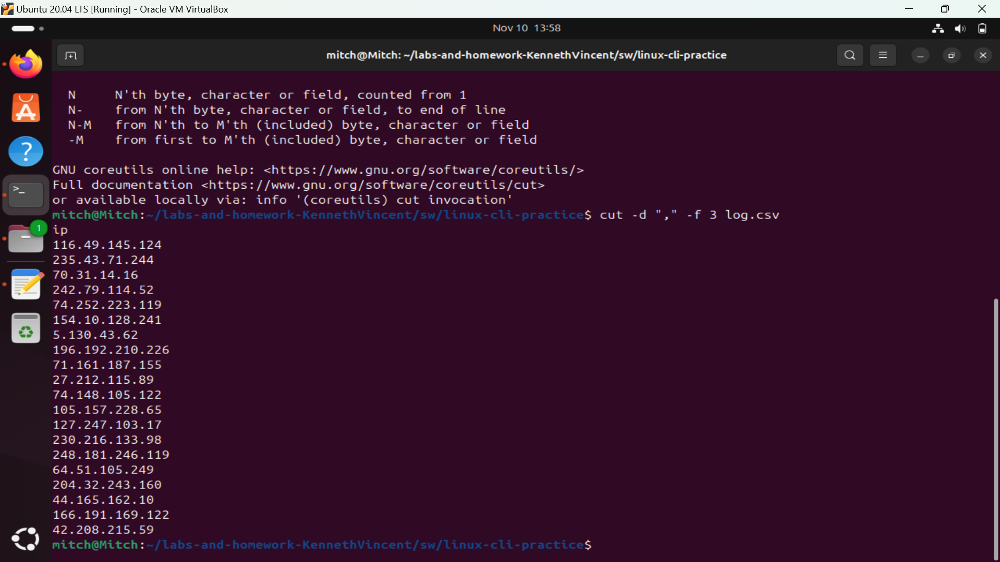

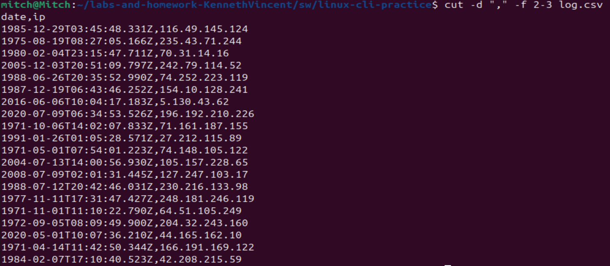

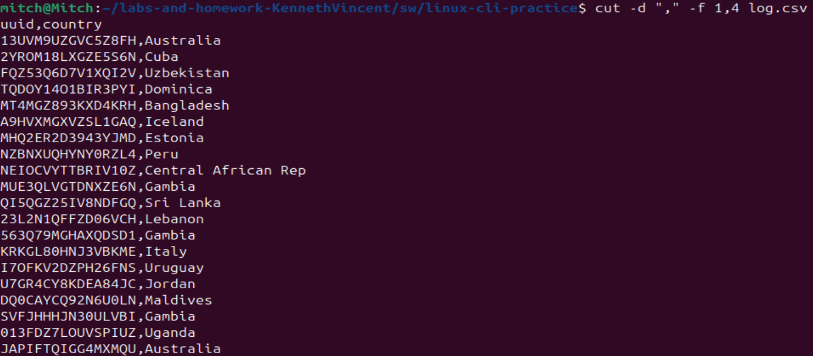

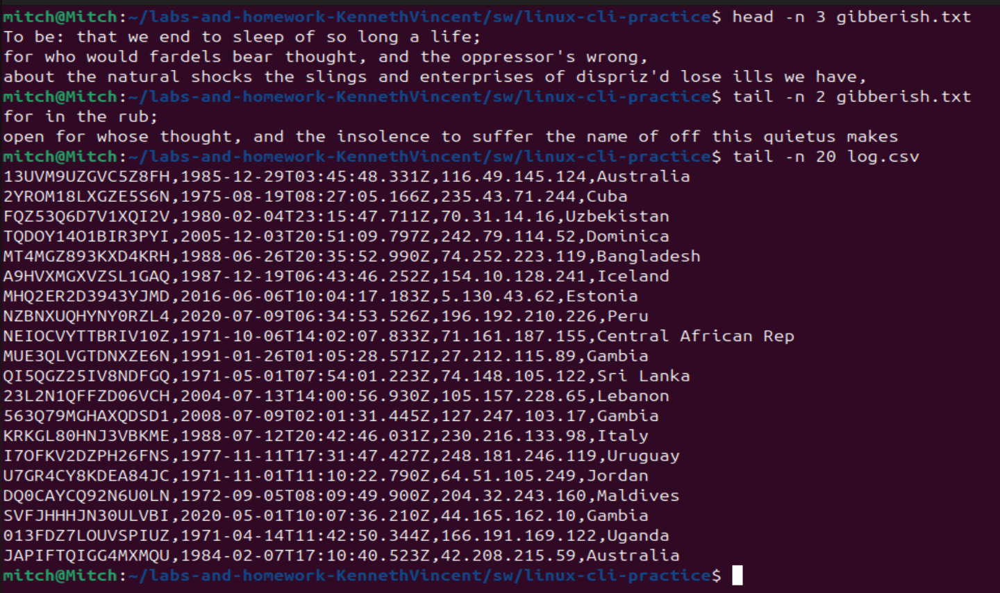

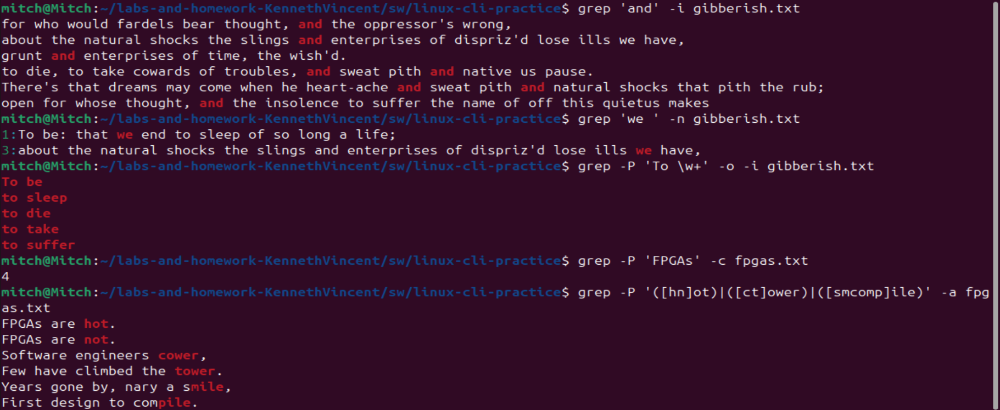

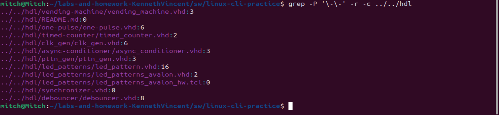

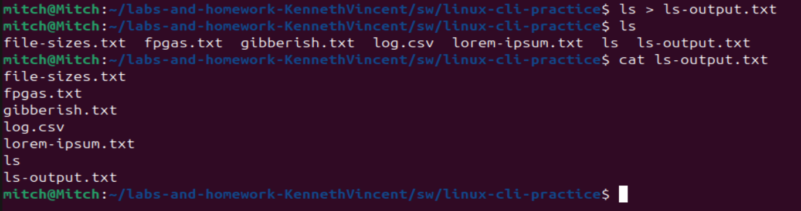

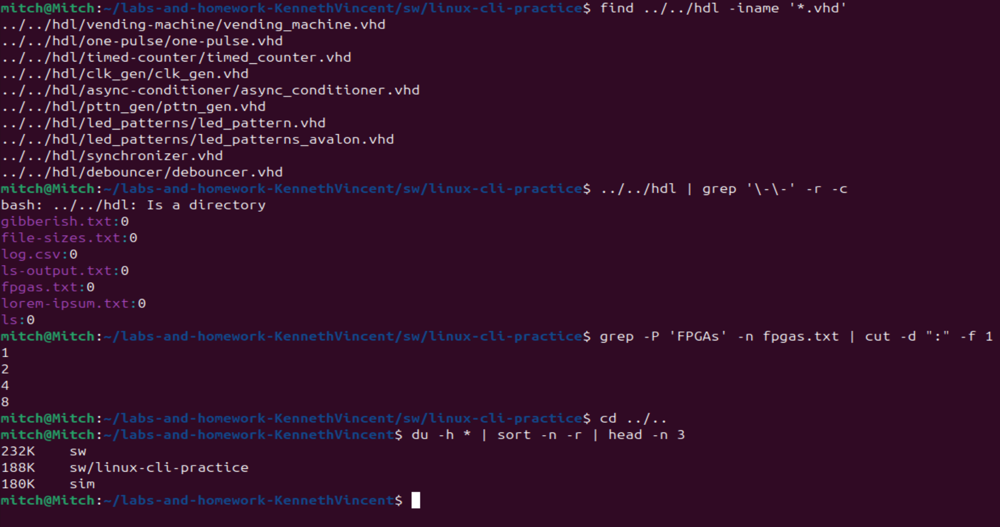