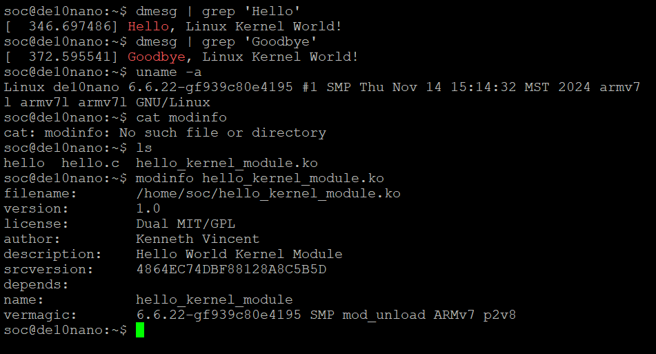

# homework 8: hello world in linux kernel
## By: Kenneth Vincent

## Overview
THis homework is to introduce the basic concepts of the Linux kernel modules and learn how
to compile them. This will be accomplish in a hello world demo.

## Deliverables
