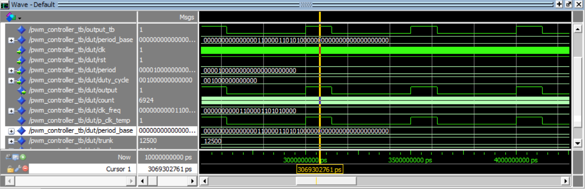
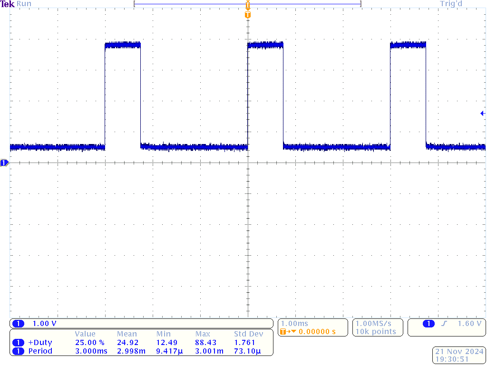
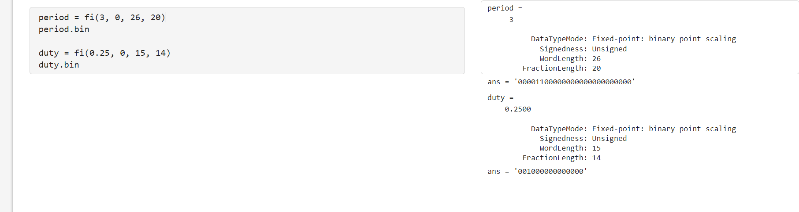

# homework 9: PWD control vhdl setup
## By: Kenneth Vincent

## Overview
To create a Pulse Width Modulated (PWM) signal to control rgb leds in the fpga.

## Deliverables

### The testbench for the PWD in model sim

### The oscilloscope for the PWD with chosen duty cycle and period

### Evidence that I understand the binary fed into the PWD
