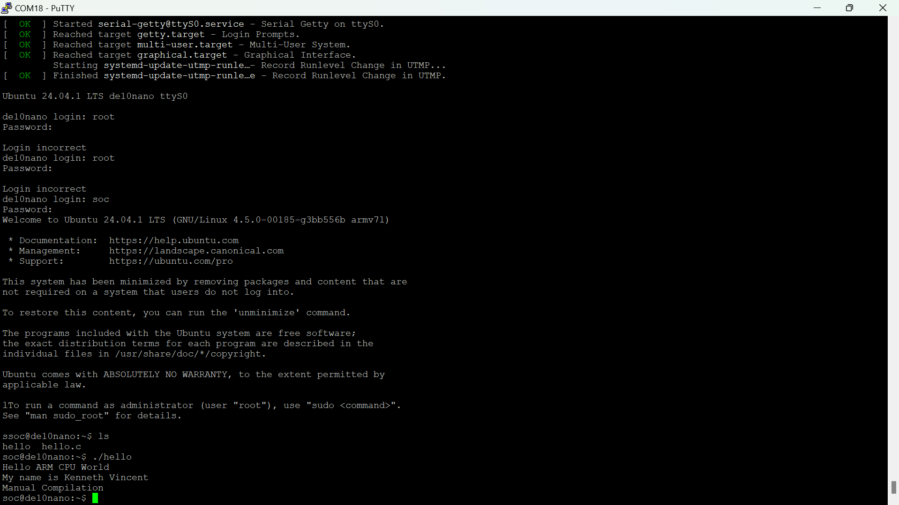

# lab 3: setting up ARM linux developer suite
### by: Kenneth Vincent

## Overveiw
For this lab, I will configure your environment to allow the DE10-Nano board to
boot from the Ubuntu VM. This is called the Developer’s Setup in which we will
modify the software in the ARM chip in C.

## Deliverables

