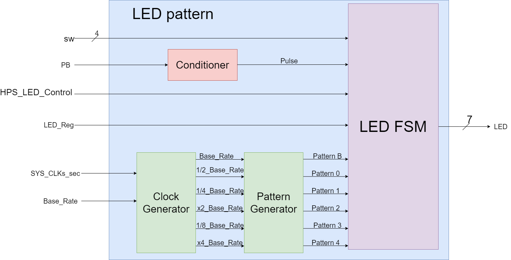
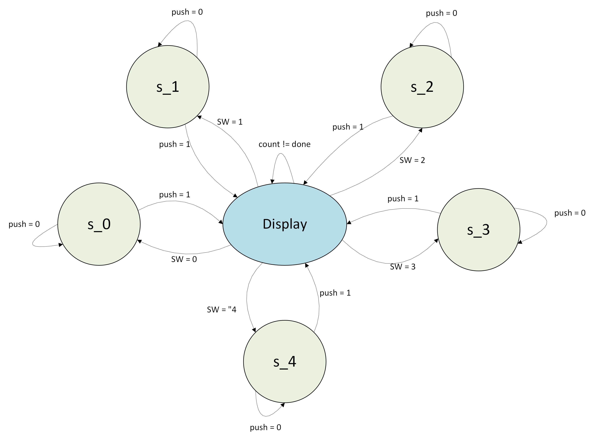

# Lab 4
### By: Kenneth Vincent

## Overveiw:
For this lab, I was tasked to create a custom hardware component that would generate
custom LED patterns based on the inputs of four switches and two buttons (there 
is a second on for reset). This Lab will be built on by other labs on the
DE10-Nano board.

### Requirments
For this Lab, there are 3 main requirements that is implemented in this lab.

# Requirement 1: 
LED7 (LEDs[7]) must always blink at 1 x base rate seconds regardless of what happens
with the whole component and FSM.

# Requirement 2: 
The FSM must have 5 total states:
               
               state 0: LEDs[6:0] must show one LED shifting to the right at 
               1/2 x base rate seconds. This is the default state.

               state 1: LEDs[6:0] must show two lit LED side-by-side shift 
               left at 1/4 x base rate seconds.

               state 2: LEDs[6:0] must show the output of a 7-bit up counter
               at 2 x base rate seconds.

               state 3: LEDs[6:0] must show the output of a 7-bit down counter
               at 1/8 x base rate seconds.

               state 4: Make a custom pattern at a custom clock rate.

# Requirment 3: 
The State transitions when the button (PB) is pressed. the sequences must happen in
this order:

               Sequence 1: the binary code of the switches (SW) is displayed on
               LEDs[6:0] for 1 second. No LEDs must be shown during this time.

               Sequence 2: The next state is determined by the binary code of
               the switches (SW). If the switches specify a next state 5 or
               greater, the next state is ignored and the current state is kept,
               but the switch value must be shown.

               Sequence 3: The next state implements the function of the states
               and stays in that state until the button (PB) was pressed again.

## System Architecture
The System for this lab can be organized in two ways.

### System Block Diagram
The System architecture runs as shown in figure 1. The input PB is feed into the
async conditioner and the output given is the pulse of the button press. The 
inputs base rate and the SYS-CLKs-sec is feed into the clock generator which will
be used to generate the needed modified rates that would be feed into the pattern
generator to produce the needed patterns for the finite state machine. The inputs 
SW, HPS-LED-CONTROL, LED-Reg, and each pattern goes into the Finite State machine
which woudl then be given the output through the LEDs.

figure 1: the system architecture block diagram.

### State Diagram
The State Diagram as shown in figure 2 shows us the visualization of the state in 
Requirment 2. Starting at the state s0 and centralized at the display state. the
whole State diagram for the finite state machine essentally waits for the PB to
equal 1 and moves to the display state to see waht state to show and when to show
after the 1 second counter is completed.

## Implementation Details
For my own implementations I have made the following:

### custom pattern and clock rate
For my custom pattern I have made the LEDs glow in this fashion everytime the
the custom base rate has a rising even:
                     sequence 1: LED[6] and LED[0] lights up.
                     sequence 2: LED[4] and LED[2] lights up.
                     sequence 3: LED[3] lights up.
For the pattern clock rate, I simply set it to be 4 x base rate seconds.

