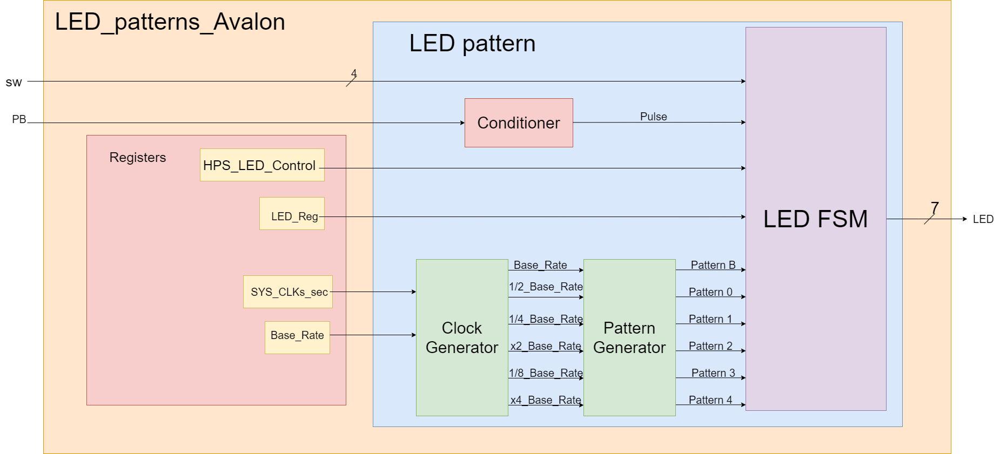
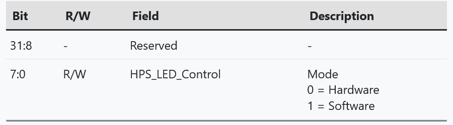
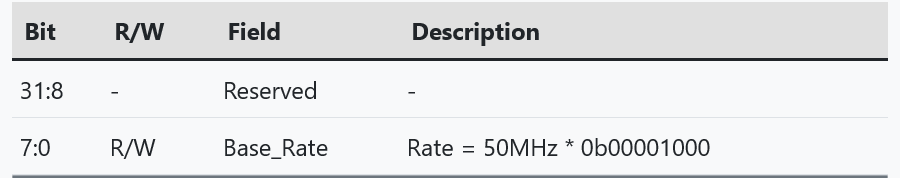
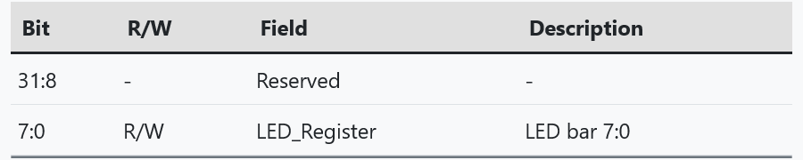

# Lab 6 report
### By: Kenneth Vincent

## Overveiw:
After creating my own LED patterns hardware, the next step is to focus on the software side of the 
FPGA. This will be done by creating registers and put them on the HPS-to-FPGA Lightweight bus so 
the software can access them via memory-mapped operations.

## System Architecture

As we can see in the image above, the LED pattern vhdl file is updated with the addition with the 
registers. This is to store the software that we can use to program the fpga to either do patterns
that is not hard coded into the vhdl itself from the ARM chip.

## Register Map

## Platform Designer
I connected the registers from the ARM to the Avalon_LED components in the hps to fpga 
serial bus system. The ARM processor serves as the master device and the Avalon_LED 
component serves as the slave device.

Due to this process in the platform designer, the base address is 0x00.

